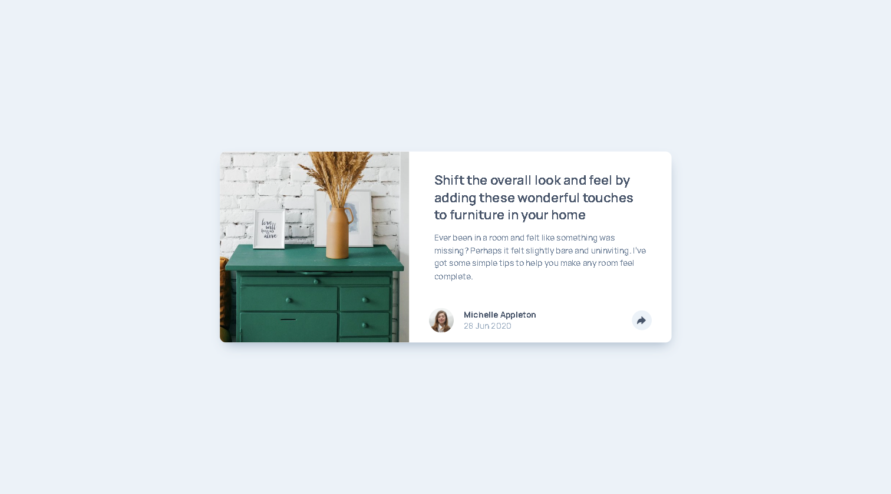
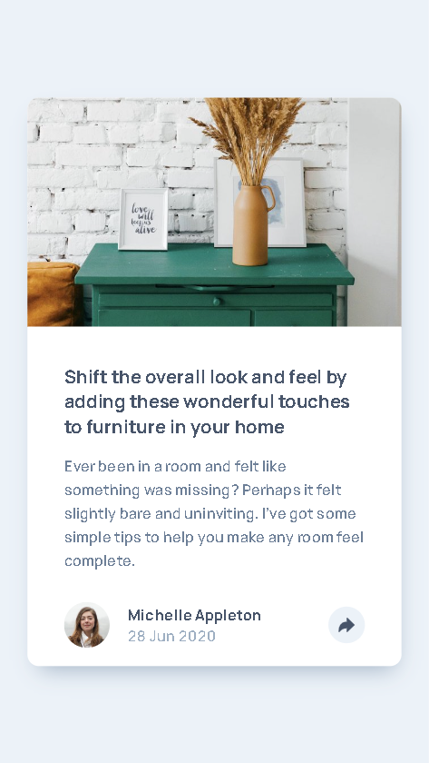
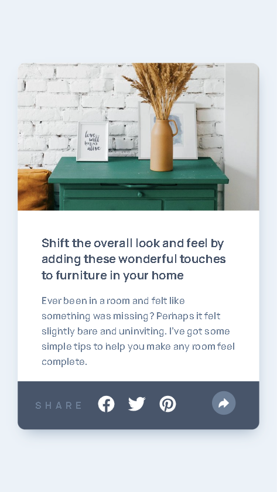

# Frontend Mentor - Article preview component solution

This is a solution to the [Article preview component challenge on Frontend Mentor](https://www.frontendmentor.io/challenges/article-preview-component-dYBN_pYFT). Frontend Mentor challenges help you improve your coding skills by building realistic projects.

## Table of contents

- [Overview](#overview)
  - [The challenge](#the-challenge)
  - [Screenshot](#screenshot)
  - [Links](#links)
- [My process](#my-process)
  - [Built with](#built-with)
  - [What I learned](#what-i-learned)
  - [Continued development](#continued-development)
  - [Useful resources](#useful-resources)
- [Author](#author)

## Overview

### The challenge

Users should be able to:

- View the optimal layout for the component depending on their device's screen size
- See the social media share links when they click the share icon

### Screenshot








### Links

- Solution URL: [Link to solution repository](https://github.com/rickyxyz/frontendmentor-projects/tree/main/article-preview-component-master)
- Live Site URL: [Link to live site](https://rickyxyz.dev/frontendmentor-projects/article-preview-component-master/index.html)

## My process

### Built with

- Semantic HTML5 markup
- CSS custom properties
- Flexbox
- Mobile-first workflow
- [SASS](https://sass-lang.com/) - For CSS Preprocessor

### What I learned

This challenge was quite straightforward, the only problem I faced is how to structure the HTML to achieve the active state for desktop and mobile view. At first, I thought I can nest the popup inside the button, but this approach will mess with the mobile layout. So instead, I put the popup as a sibling of the share button and just absolutely positioned the element and used z-index to show it properly.

```css
.share-section {
  display: none;
  position: absolute;
  z-index: 2;
  ...;
}
```

### Continued development

I think I need to polish my naming convention and HTML semantics more. In the future, I also want to improve my JavaScript for future challenges. I would also like to improve my speed when working on challenges, cause I think this challenge took longer than what I expected.

### Useful resources

- [W3Schools CSS Tooltop](https://www.w3schools.com/css/css_tooltip.asp) - This article helped me to get started on making the popup for the desktop site.

## Author

- Website - [rickyxyz.dev](https://rickyxyz.dev)
- Frontend Mentor - [@rickyxyz](https://www.frontendmentor.io/profile/rickyxyz)
