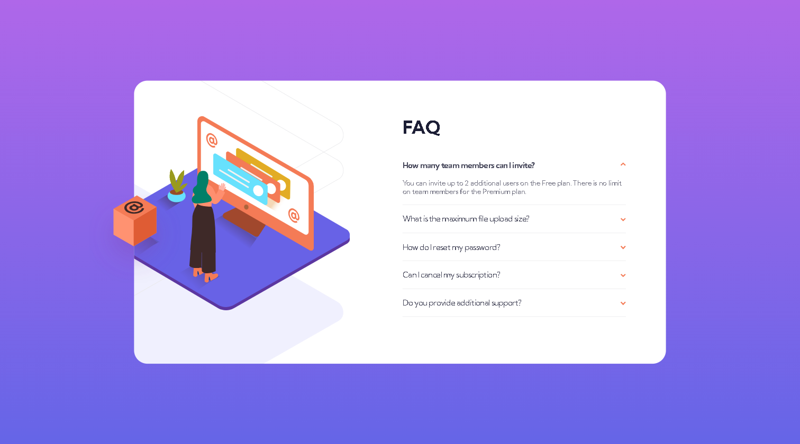

# Frontend Mentor - FAQ accordion card solution

This is a solution to the [FAQ accordion card challenge on Frontend Mentor](https://www.frontendmentor.io/challenges/faq-accordion-card-XlyjD0Oam). Frontend Mentor challenges help you improve your coding skills by building realistic projects.

## Table of contents

- [Overview](#overview)
  - [The challenge](#the-challenge)
  - [Screenshot](#screenshot)
  - [Links](#links)
- [My process](#my-process)
  - [Built with](#built-with)
  - [What I learned](#what-i-learned)
  - [Continued development](#continued-development)
  - [Useful resources](#useful-resources)
- [Author](#author)

## Overview

### The challenge

Users should be able to:

- View the optimal layout for the component depending on their device's screen size
- See hover states for all interactive elements on the page
- Hide/Show the answer to a question when the question is clicked

### Screenshot




### Links

- Solution URL: [Link to solution repository](https://github.com/rickyxyz/frontendmentor-projects/tree/main/faq-accordion-card-main)
- Live Site URL: [Link to live site](https://rickyxyz.dev/frontendmentor-projects/faq-accordion-card-main/index.html)

## My process

### Built with

- Semantic HTML5 markup
- CSS custom properties
- Flexbox
- Mobile-first workflow
- SASS/SCSS
- Vanilla JS

### What I learned

Personally, I think the JS involved in this challenge is quite straightforward. Although, I needed to add more lines to the script because I decided to only one accordion item can be opened at a time. I think that added the extra complexity that I rather not have.

The CSS of this challenge however took quite a while to figure out how to scale the SVG images to fit screen sizes. I used a combination of clamp(), min(), and vw unit to scale the image as best as I can to the screen size.

```css
/* class for mobile */
&_illustration {
  background: url("./images/illustration-woman-online-mobile.svg") no-repeat;
  background-size: contain;
  width: 50vw;
  height: clamp(5rem, 40vw, 40rem);
  left: 50%;
  position: absolute;
  transform: translate(-50%, -58%);
}

/* class for desktop */
&_illustration {
  background: url("./images/illustration-woman-online-desktop.svg") no-repeat;
  background-size: contain;
  width: min(32vw, 38rem);
  height: min(26.6vw, 29rem);
  left: -16%;
  top: 50%;
  position: relative;
  transform: translate(0, -50%);
}
```

a part of the CSS used for scaling the image.

### Continued development

Looking at my SCSS again, I think I could make it better using mixins. However, I am not sure yet how to use mixin in SCSS. I am also pretty sure my JS code could be streamlined, however I don't know how yet.

### Useful resources

- [W3Schools How To Accordion](https://www.w3schools.com/howto/howto_js_accordion.asp) - This article helped me get started on making the JS for the accordion.

## Author

- Website - [rickyxyz.dev](https://www.rickyxyz.github.io)
- Frontend Mentor - [@rikcyxyz](https://www.frontendmentor.io/profile/rickyxyz)
