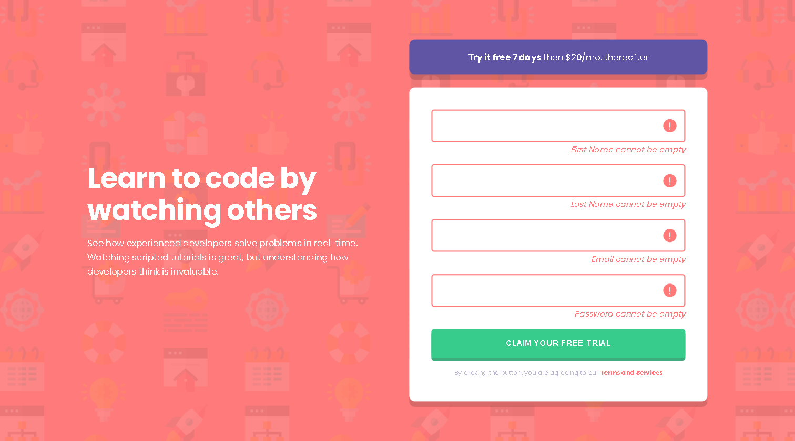

# Frontend Mentor - Intro component with sign up form solution

This is a solution to the [Intro component with sign up form challenge on Frontend Mentor](https://www.frontendmentor.io/challenges/intro-component-with-signup-form-5cf91bd49edda32581d28fd1). Frontend Mentor challenges help you improve your coding skills by building realistic projects.

## Table of contents

- [Overview](#overview)
  - [The challenge](#the-challenge)
  - [Screenshot](#screenshot)
  - [Links](#links)
- [My process](#my-process)
  - [Built with](#built-with)
  - [What I learned](#what-i-learned)
  - [Continued development](#continued-development)
  - [Useful resources](#useful-resources)
- [Author](#author)
- [Acknowledgments](#acknowledgments)

## Overview

### The challenge

Users should be able to:

- View the optimal layout for the site depending on their device's screen size
- See hover states for all interactive elements on the page
- Receive an error message when the `form` is submitted if:
  - Any `input` field is empty. The message for this error should say _"[Field Name] cannot be empty"_
  - The email address is not formatted correctly (i.e. a correct email address should have this structure: `name@host.tld`). The message for this error should say _"Looks like this is not an email"_

### Screenshot

desktop viewport

desktop viewport active state

mobile viewport

### Links

- Solution URL: [Link to solution repository](https://github.com/rickyxyz/frontendmentor-projects/tree/main/intro-component-with-signup-form-master)
- Live Site URL: [Link to live site](https://rickyxyz.dev/frontendmentor-projects/intro-component-with-signup-form-master/index.html)

## My process

### Built with

- Semantic HTML5 markup
- CSS custom properties
- Flexbox
- Mobile-first workflow
- [SASS](https://sass-lang.com/) - CSS Preprocessor

### What I learned

The HTML and CSS in this challenge is quite straightforward for me at this point.
The only things that caused me to slow down a little bit is how to do the form validation with as little repetition as possible.
Sure I can just write a lot of if statement for the validation to validate all the inputs, but I think that approach is cumbersome
and will make the code less maintainable and expandable. So, I searched the internet on how to do the form validation as best as possible.
The I found this YouTube video [The BEST way to do form validation in JavaScript](https://youtu.be/iyngFd6f8ko) on how to do the form validation.
Most of the code in my JS file is from the video above or a modified version of it 😊.

### Continued development

For the future, I would like to improve my JS skills. Especially things that are related to user inputs on the webpage.

### Useful resources

- [The BEST way to do form validation in JavaScript](https://youtu.be/iyngFd6f8ko) - This video helped figuring out how to do the form validation with less repetition.
- [Learn JavaScript form validation || JavaScript project for beginners ✨✨](https://youtu.be/VufN46OyFng) - This video helped me figure out how to structure my HTML better.

## Author

- Website - [github.com/rickyxyz](https://github.com/rickyxyz)
- Frontend Mentor - [@rickyxyz](https://www.frontendmentor.io/profile/rickyxyz)
