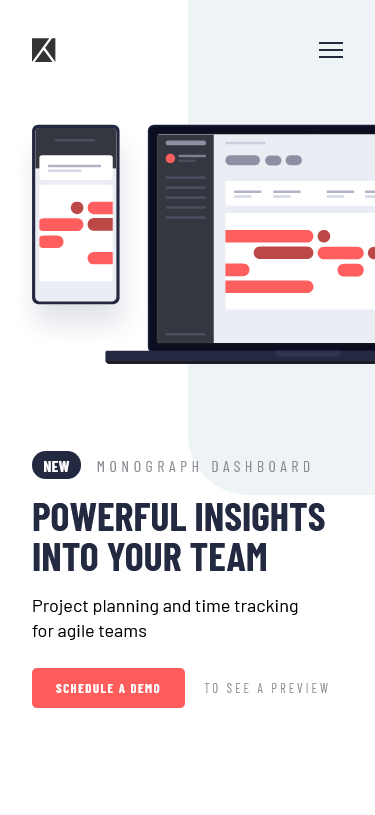
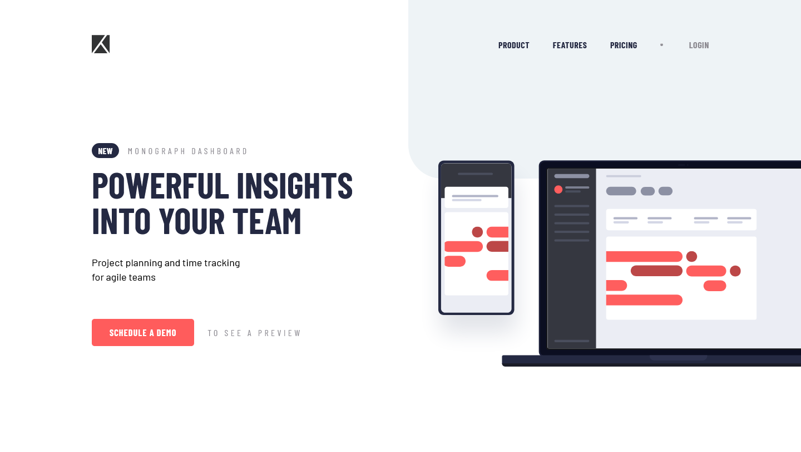

# Frontend Mentor - Project tracking intro component solution

This is a solution to the [Project tracking intro component challenge on Frontend Mentor](https://www.frontendmentor.io/challenges/project-tracking-intro-component-5d289097500fcb331a67d80e). Frontend Mentor challenges help you improve your coding skills by building realistic projects.

## Table of contents

- [Overview](#overview)
  - [The challenge](#the-challenge)
  - [Screenshot](#screenshot)
  - [Links](#links)
- [My process](#my-process)
  - [Built with](#built-with)
  - [What I learned](#what-i-learned)
  - [Continued development](#continued-development)
  - [Useful resources](#useful-resources)
- [Author](#author)
- [Acknowledgments](#acknowledgments)

**Note: Delete this note and update the table of contents based on what sections you keep.**

## Overview

### The challenge

Users should be able to:

- View the optimal layout for the site depending on their device's screen size
- See hover states for all interactive elements on the page
- Create the background shape using code

### Screenshot

### Links

- Solution URL: [Link to solution repository](https://github.com/rickyxyz/frontendmentor-projects/tree/main/project-tracking-intro-component-master)
- Live Site URL: [Link to live site](https://rickyxyz.dev/frontendmentor-projects/project-tracking-intro-component-master/index.html)

## My process

### Built with

- Semantic HTML5 markup
- CSS custom properties
- Flexbox
- CSS Grid
- Mobile-first workflow

### What I learned

#### Accessibility & ARIA attribute usage.

For this project, I tried to focus on learning accessibility and ARIA attributes.

Tried HTML new popover API
Take care of the "in-between" states too

### Continued development

Look into more modern CSS selector
Look into CSS positioning techniques
Look into more ARIA attributes

### Useful resources

- [Frontend Mentor: Introduction to web accessibility](https://www.frontendmentor.io/learning-paths/introduction-to-web-accessibility-mXu-9PHVsd) - This Frontend Mentor learning path is where I look for most of the links for web accessibility.
- [CSS Popover + Anchor Positioning is Magical (Video by Kevin Powell)](https://www.youtube.com/watch?v=DNXEORSk4GU) - This is where I learned how to use the popover API.

## Author

- Website - [rickyxyz.dev](https://www.rickyxyz.github.io)
- Frontend Mentor - [@rickyxyz](https://www.frontendmentor.io/profile/rickyxyz)
